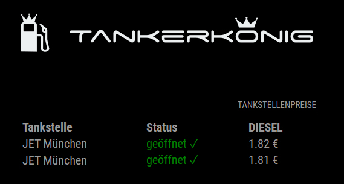

# MMM-Tankerkoenig [](https://github.com/wiesty/MMM-Tankerkoenig/raw/master/LICENSE)

MagicMirror² Module to display the local gas prices in Germany.



## Dependencies

* instance of [MagicMirror²](https://github.com/MichMich/MagicMirror)
* Node Fetch (linux: npm install node-fetch)

## Installation

1. Clone this repository in your MagicMirror installation into the folder modules.
    `git clone https://github.com/wiesty/MMM-Tankerkoenig`
2. Install dependencies (If not installed yet) in the main MagicMirror folder (npm install node-fetch)
3. Get your free* api key from [creativecommons.tankerkoenig.de](https://creativecommons.tankerkoenig.de/)
4. Head over to [Tankerkoenig Station API Helper](https://wiesty.de/tkhelper/) and copy your IDs
5. Search your station and modify the config template below
6. Add configuration to your config.js

## Config

```js
{
    module: "MMM-Tankerkoenig",
    position: "bottom_right",
    config: {
        apiKey: "00000000-0000-0000-0000-000000000000", 
        updateInterval: 600000, // update interval in ms (10 mins)
        stationNames: {
            "24a381e3-0d72-416d-bfd8-b2f65f6e5802": "Esso Tankstelle", //ID with custom name
            "474e5046-deaf-4f9b-9a32-9797b778f047": "Total Berlin", //another ID possible
        },
        fuelTypes: ["e5", "e10", "diesel"] //filter gas types
    }
},
```

## Notes

Right now this is a simple version of the tankerkoenig api. Might add more features some time.

To reduce the network traffic, you have to enter the name of the desired station manually :-)

*No guarantee of information accuracy - API may transition from Free to Paid version at any time.
